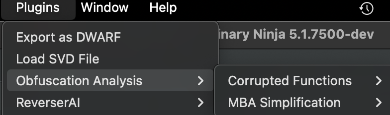
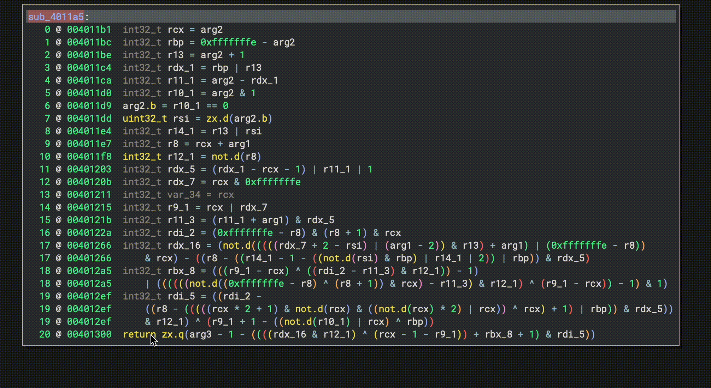
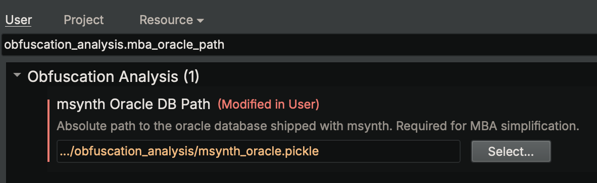

# Obfuscation Analysis (v1.0)
Authors: **Tim Blazytko & Nicolò Altamura**

_Analyze and simplify obfuscated code_


## Description:

_Obfuscation Analysis_ is a Binary Ninja plugin that takes the pain out of working with heavily protected binaries.
It bundles a handful of focused helpers that let you

* simplify Mixed-Boolean Arithmetic (MBA) expressions in one click (based on [msynth](https://github.com/mrphrazer/msynth))
* locate and scrub functions with broken disassembly

Some example use cases can be found in [examples](./examples). The plugin complements [Obfuscation Detection](https://github.com/mrphrazer/obfuscation_detection/): once suspicious functions are flagged, _Obfuscation Analysis_ helps you clean and understand them. More helpers will be added over time.


## Core Features

* simplify Mixed-Boolean Arithmetic obfuscation in Binary Ninja's decompiler view
* identify and remove functions with broken disassembly
* efficient and architecture-agnostic implementation
* runs as a background task
* careful error handling: concise user messages, full trace in the Debug log


## Installation

The tool can be installed using Binary Ninja's plugin manager.

For a manual installation, follow these steps in Binary Ninja's plugin folder:

```
git clone https://github.com/mrphrazer/obfuscation_analysis.git
cd obfuscation_analysis

# optionally: use a virtual environment
python -m venv obfana-env
source obfana-env/bin/activate

# install requirements
pip install -r requirements.txt
```

If you use a virtual environment, you'll need to manually set the `site-packages` path in the Binary Ninja settings.


## Usage

The plugin is available from **Binary Ninja’s** top-bar menu under `Plugins -> Obfuscation Analysis`.

<p align="left">

</p>


### MBA Simplification

To simplify arithmetic obfuscation, first highlight the HLIL expression you want to simplify in the decompiler view. Next, choose `Plugins -> Obfuscation Analysis -> MBA Simplification -> Slice & Simplify`. The plugin resolves the full computation, runs it through msynth, and inserts the simplified result as a comment on the same line. The short animation below shows the entire workflow:

<p align="left">

</p>

MBA simplification relies on msynth. By default, the plugin uses [msynth’s default simplification oracle](https://github.com/mrphrazer/msynth?tab=readme-ov-file#pre-computed-simplification-lookup-tables), which ships with the plugin and is pre-configured. If you want to use a larger or custom oracle, set `obfuscation_analysis.mba_oracle_path` manually or browse to the file in Binary Ninja’s Settings window.

<p align="left">

</p>

If something goes wrong the plugin writes a concise user-level message to the Log pane; switch the log view to `Debug` to see the full traceback.

<p align="left">

</p>


## Features

The plugin ships focused helpers that target common roadblocks you hit when reversing protected binaries, each runnable as a background task from the UI or head-less scripts. Below are the features currently available.


### Corrupted Functions

Corrupted Functions are functions whose disassembly shows undefined artefacts—empty basic blocks, invalid or overlapping instructions, and the like. This helper walks the entire BinaryView, flags functions with those symptoms, and lists them such that the analyst can quickly inspect code that was mis-parsed or deliberately obfuscated. An optional remove action erases every flagged function and forces a fresh analysis, cleaning up the function list. It is particularly useful for locating

* data blobs that the disassembler mistakenly promoted to code
* obfuscation stubs that break straight-line disassembly
* functions using overlapping instructions or mis-aligned jumps
* problems with newer architectures where uncommon instructions are encountered


### MBA Simplification

Mixed-Boolean Arithmetic (MBA) is an obfuscation technique that buries simple computations in long chains of arithmetic and Boolean operations. This feature simplifies such expressions in the decompiler. When you pick an HLIL instruction, the plugin collects its complete computation chain with an SSA backward slice restricted to the current basic block, translates that slice to Miasm IR, feeds it into msynth, and finally adds the simplified result as a comment in the decompiler view. This feature allows you to

* collapse multi-line MBA tangles into a single, readable equation
* resolve opaque predicates that rely on MBAs
* fold convoluted constant encodings down to their literal value


## Limitations

The plugin has a few caveats you should be aware of, most of them related to the MBA simplification pipeline:

* **Binary Ninja bug**: on BN 5.0 stable, the backward-slicing step may fail because of missing HLIL type-casts: https://github.com/Vector35/binaryninja-api/issues/6371; the issue is fixed in *5.1.7477-de* and newer

* **slice confined to one basic block**: variable definitions located in predecessor blocks are ignored (often control-flow dependent), so some MBA terms may stay partially resolved

* **HLIL to Miasm IR translation gaps**: not every HLIL construct has a sound Miasm equivalent; when translation fails the expression is skipped and an error is logged

* **IL coverage**: control-flow nodes and floating-point operations are currently not translated

* **inherited msynth constraints** : MBA simplification inherits all [msynth limitations](https://github.com/mrphrazer/msynth/blob/main/README.md#limitations-and-future-work)


## Contact

For more information, contact Tim Blazytko ([@mr_phrazer](https://x.com/mr_phrazer)) or Nicolò Altamura ([@nicolodev](https://x.com/nicolodev)).
