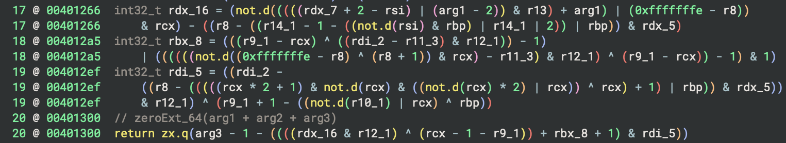
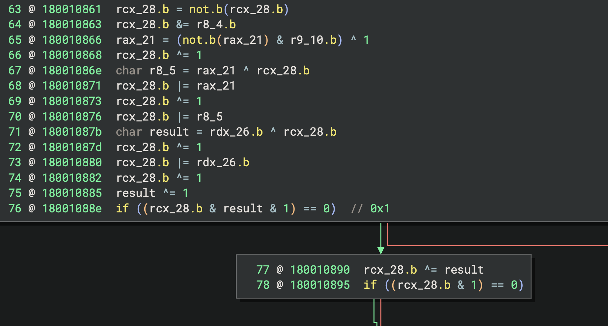

# Example Use Cases

The samples provided in `samples.zip` can be used to test the plugin and reproduce the results. To unpack, use the password "infected" or the following command:

```bash
$ unzip -P infected samples.zip
```


## Hiding Arithmetic Computations

`challenge.bin` packs several function-local MBA expressions that hide otherwise trivial calculations.  Applying `Slice & Simplify` on the return instructions collapse the MBAs into their readable form.

<p align="left">

</p>


## Opaque Predicates

`opaque_malware.bin` relies on MBA-based opaque predicates to obfuscate its control flow. Each predicate is limited to a single basic block and evaluates to aconstant 0 or 1, but the original expression is purposefully convoluted. Running the simplifier on these branches reveals the constant outcome, making the hidden control-flow obvious.

<p align="left">

</p>

